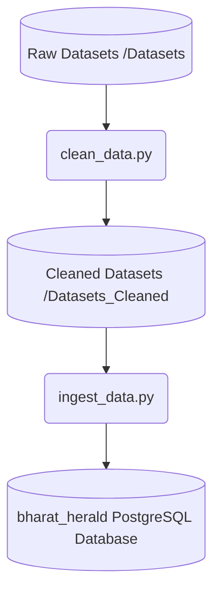

# Data Cleaning & Standardization Report: Bharat Herald Strategic Analysis

This report documents the anomalies, inconsistencies, and issues identified in the raw datasets for the Bharat Herald strategic analysis, along with the cleaning pipeline designed to standardize and sanitize the data before it is ingested into the analytical database.

---

## 1. Raw Data Issues & Anomalies Identified

During exploratory data analysis and database validation, several severe data quality issues were identified across all raw datasets:

### A. Formatting Anomalies (Rupee Symbols in Numeric Fields)
*   **Dataset:** `fact_print_sales.xlsx` (Sheet: `fact_print_sales`)
*   **Issue:** The `Copies Sold` column (which represents gross copy count/copies printed) contained currency prefixes in 66 rows (e.g. `₹216680` instead of `216680`). Since copy counts are quantities rather than financial values, these currency symbols represent data entry errors and prevented mathematical operations.

### B. Inconsistent Casing & Incomplete Encodings
*   **Dataset:** `fact_print_sales.xlsx` (Sheet: `fact_print_sales`)
*   **Issue:** The `Language` column contained casing duplicates (`Hindi`, `hindi`, `english`, `ENGLISH`).
*   **Dataset:** `dim_city.xlsx` (Sheet: `in`)
*   **Issue:** State names contained mixed casings—some in Title Case and others in ALL CAPS (e.g., `DELHI`, `BIHAR`, `MAHARASHTRA`, `JHARKHAND`, `UTTAR PRADESH`, `GUJARAT` alongside `Uttar Pradesh`, `Madhya Pradesh`, `Rajasthan`).

### C. Mismatched and Inconsistent Naming Conventions
*   **Dataset:** `fact_print_sales.xlsx`
*   **Issue:** State names were encoded using various symbols and formatting styles (e.g. `Uttar pradesh`, `Uttar-Pradesh`, `Madhya_Pradesh`, `maharashtra`, `gujarat`, `bihar`, `Uttar Pradesh`). This prevented proper joins with `dim_city` on geographic fields.

### D. Multiple Currency Formats & Raw Inconsistencies
*   **Dataset:** `fact_ad_revenue.csv`
*   **Issue:** The revenue amounts were reported across multiple currencies (`EUR`, `USD`, `INR`, `IN RUPEES`) and included casing/format variations. Comparing raw numbers directly would lead to incorrect financial summaries (e.g., adding $100 USD to 100 INR as 200). Additionally, `IN RUPEES` had to be unified with `INR`.

### E. Mismatched Time/Granularity Formats
*   **Dataset:** `fact_ad_revenue.csv` & `fact_city_readiness.csv`
*   **Issue:** Quarters were represented in varying strings (e.g., `2023-Q2`, `Q1-2019`, and `4th Qtr 2020`). They needed standardization to a clean date-compatible key.

### F. Bounce Rate Granularity Inconsistency
*   **Dataset:** `fact_digital_pilot.csv`
*   **Issue:** The `avg_bounce_rate` column contained percentage values (e.g., `65.76` for `65.76%`) but was expected by the database schema to be a ratio between `0` and `1` (e.g. `0.6576`).

---

## 2. Implemented Data Cleaning Rules

A dedicated cleaning script (`scripts/clean_data.py`) was implemented to process the raw datasets. The following rules were applied to resolve the anomalies:

| Table / Dataset | Column | Cleaning / Standardization Rule |
| :--- | :--- | :--- |
| **`fact_print_sales`** | `Copies Sold` | Stripped non-numeric formatting (e.g. `₹`) and cast to integer. |
| **`fact_print_sales`** | `Language` | Stripped leading/trailing spaces and standardized to Title Case (`Hindi`, `English`). |
| **`fact_print_sales`** | `State` | Standardized to Title Case and matched to unified names: `Uttar Pradesh`, `Madhya Pradesh`, `Delhi`, `Bihar`, `Rajasthan`, `Maharashtra`, `Jharkhand`, `Gujarat`. |
| **`fact_print_sales`** | `Net_Circulation` | Re-calculated net circulation using the formula: `Copies Sold - copies_returned` to guarantee strict mathematical consistency. |
| **`dim_city`** | `state` | Standardized all uppercase and lowercase variations to Title Case. |
| **`fact_ad_revenue`** | `quarter` | Unified all quarter strings to the standard `YYYY-Q#` format. |
| **`fact_ad_revenue`** | `currency` | Unified `IN RUPEES` and `INR` to `INR`. Standardized currency codes to uppercase. |
| **`fact_ad_revenue`** | `ad_revenue_in_inr` | Automatically calculated converted values in INR based on standard exchange rates (1 USD = 80.0 INR, 1 EUR = 85.0 INR, 1 INR = 1.0 INR). |
| **`fact_city_readiness`**| `quarter` | Normalized quarter strings to standard `YYYY-Q#` format. |
| **`fact_digital_pilot`** | `avg_bounce_rate`| Divided raw percentage values by `100.0` to convert them to a ratio between `0` and `1` matching database checks. |

---

## 3. Cleaning Pipeline Architecture

To prevent database contamination and preserve raw history, we introduced a two-stage pipeline:

1.  **Exploratory Stage (`scripts/clean_data.py`):** Reads files from the original `Datasets/` directory, runs the cleaning rules, and writes standardized versions of all datasets to `Datasets_Cleaned/`.
2.  **Ingestion Stage (`scripts/ingest_data.py`):** Automatically triggers the cleaning script, drop-recreates database tables from `sql/schema.sql`, and copies cleaned files from `Datasets_Cleaned/` directly into the database.

This architecture ensures that raw datasets remain intact for audit logs, while downstream analytics tables in PostgreSQL are guaranteed to be clean, typed, and consistent.
