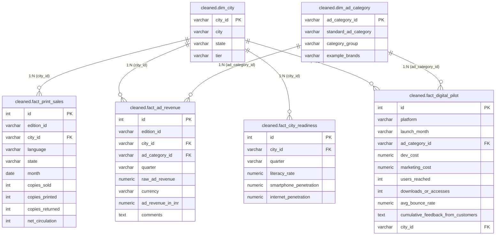

# Power BI Handover Documentation: Bharat Herald Strategic Analysis

This documentation provides the details needed to connect Power BI to the PostgreSQL database, establish the data model, and implement key DAX measures for dashboards.

---

## 1. Data Model Schema (Star Schema)

The database `bharat_herald` is structured as a star schema consisting of two dimension tables and four fact tables under the `cleaned` schema. The raw untransformed data is in the `raw` schema, and pre-calculated analytical results are in the `analytics` schema.



---

## 2. Table Relationships (Power BI Setup)

When importing these tables into Power BI, set up the following relationships in the **Model View**:

1. **`dim_city` to `fact_print_sales`**
   - Left (Dimension): `dim_city.city_id`
   - Right (Fact): `fact_print_sales.city_id`
   - Cardinality: **1 to Many (1:*)**
   - Cross filter direction: **Single** (Dimension filters Fact)

2. **`dim_city` to `fact_ad_revenue`**
   - Left (Dimension): `dim_city.city_id`
   - Right (Fact): `fact_ad_revenue.city_id`
   - Cardinality: **1 to Many (1:*)**
   - Cross filter direction: **Single**

3. **`dim_city` to `fact_city_readiness`**
   - Left (Dimension): `dim_city.city_id`
   - Right (Fact): `fact_city_readiness.city_id`
   - Cardinality: **1 to Many (1:*)**
   - Cross filter direction: **Single**

4. **`dim_city` to `fact_digital_pilot`**
   - Left (Dimension): `dim_city.city_id`
   - Right (Fact): `fact_digital_pilot.city_id`
   - Cardinality: **1 to Many (1:*)**
   - Cross filter direction: **Single**

5. **`dim_ad_category` to `fact_ad_revenue`**
   - Left (Dimension): `dim_ad_category.ad_category_id`
   - Right (Fact): `fact_ad_revenue.ad_category_id`
   - Cardinality: **1 to Many (1:*)**
   - Cross filter direction: **Single**

6. **`dim_ad_category` to `fact_digital_pilot`**
   - Left (Dimension): `dim_ad_category.ad_category_id`
   - Right (Fact): `fact_digital_pilot.ad_category_id`
   - Cardinality: **1 to Many (1:*)**
   - Cross filter direction: **Single**

*Note: In Power BI, we also recommend creating a **Date Dimension** (using DAX `CALENDARAUTO()`) and linking it to the `fact_print_sales.month` column to enable smooth time intelligence reporting.*

---

## 3. Recommended DAX Measures

Implement the following DAX measures in your Power BI file to calculate the key business metrics shown in the dashboard report:

### A. Print Operations & Efficiency
```dax
// Total copies printed
Total Copies Printed = SUM(fact_print_sales[copies_printed])

// Total copies sold (gross before returns)
Total Copies Sold (Gross) = SUM(fact_print_sales[copies_sold])

// Total copies returned
Total Copies Returned = SUM(fact_print_sales[copies_returned])

// Net copies circulated
Total Net Circulation = SUM(fact_print_sales[net_circulation])

// Print Return Waste Rate (%)
Print Return Waste Rate = DIVIDE([Total Copies Returned], [Total Copies Printed], 0)

// Print Circulation Efficiency
Print Efficiency = DIVIDE([Total Net Circulation], [Total Copies Printed], 0)
```

### B. Advertising Revenue
```dax
// Total ad revenue in Indian Rupees
Total Ad Revenue (INR) = SUM(fact_ad_revenue[ad_revenue_in_inr])

// Ad revenue per Net Circulated copy (ROI indicator)
Ad Revenue per Circulated Copy = DIVIDE([Total Ad Revenue (INR)], [Total Net Circulation], 0)
```

### C. Digital Readiness
```dax
// Average Smartphone Penetration
Avg Smartphone Penetration (%) = AVERAGE(fact_city_readiness[smartphone_penetration])

// Average Internet Penetration
Avg Internet Penetration (%) = AVERAGE(fact_city_readiness[internet_penetration])

// Composite Digital Readiness Score
Composite Digital Readiness = 
AVERAGEX(
    fact_city_readiness, 
    (fact_city_readiness[literacy_rate] + fact_city_readiness[smartphone_penetration] + fact_city_readiness[internet_penetration]) / 3
)
```

### D. Digital Pilot Performance
```dax
// Total dev cost
Total Dev Cost (INR) = SUM(fact_digital_pilot[dev_cost])

// Total marketing cost
Total Marketing Cost (INR) = SUM(fact_digital_pilot[marketing_cost])

// Total user downloads/accesses
Total Downloads = SUM(fact_digital_pilot[downloads_or_accesses])

// Digital pilot conversion/engagement rate
Digital Pilot Engagement Rate = DIVIDE(SUM(fact_digital_pilot[downloads_or_accesses]), SUM(fact_digital_pilot[users_reached]), 0)

// Average bounce rate for pilot platform
Avg Bounce Rate = AVERAGE(fact_digital_pilot[avg_bounce_rate])
```

---

## 4. Key Visualizations for the Power BI Dashboard

Based on the executive findings, we recommend organizing the dashboard pages as follows:

1. **Executive Overview Page**:
   - KPIs: Total Net Circulation (Card), Total Ad Revenue (Card), Average Print Efficiency (Gauge), Composite Digital Readiness (Card).
   - Visual 1: Line Chart of Yearly Copies Printed vs Net Circulation (shows decline trend).
   - Visual 2: Stacked Bar Chart of Ad Revenue by City Tier.
   
2. **Print Performance Page**:
   - Visual 1: Bar Chart of Print Return Waste Rate by City.
   - Visual 2: Matrix of City, Language, copies_printed, copies_returned, net_circulation, and Print Efficiency.
   
3. **Advertising Revenue Page**:
   - Visual 1: Donut Chart of Ad Revenue Share by Category.
   - Visual 2: Line/Column Chart showing Ad Revenue vs Circulation ROI (ad revenue per circulated copy) over years.
   
4. **Digital Transition Readiness Page**:
   - Visual 1: Scatter Chart comparing digital readiness score (X-axis) with digital pilot downloads (Y-axis) by City (reveals outliers like Lucknow and Bhopal).
   - Visual 2: Table showing relaunch index scorecard (Readiness, Decline, Pilot Engagement, and Composite Priority Rank).
