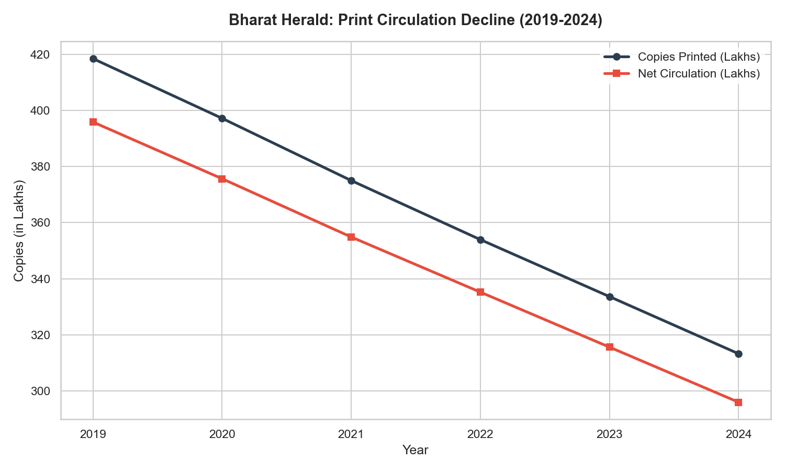
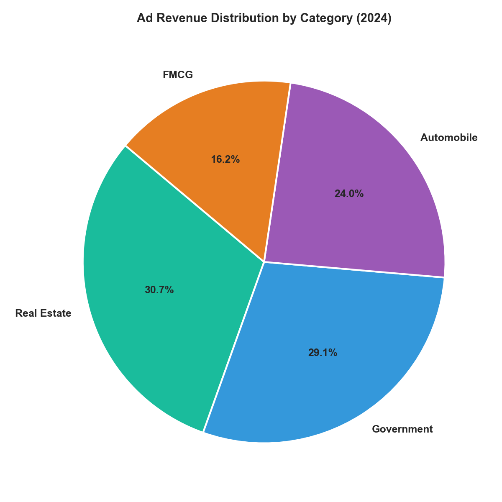
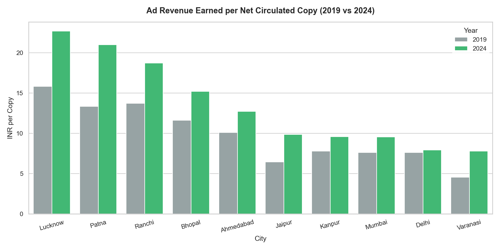
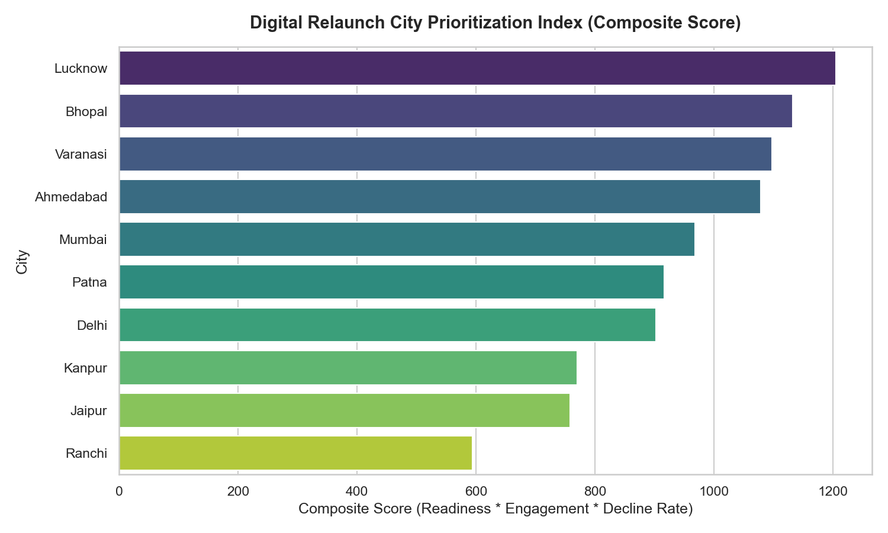

# Strategic Business Analysis of Bharat Herald (2019-2024)
*Compiled by Peter Pandey (Lead Data Analyst) for Tony Sharma (Executive Director)*

This report provides the data-backed answers and strategic recommendations requested to evaluate the print operations decline of Bharat Herald and prioritize its digital relaunch.

---

## Business Request 1: Monthly Circulation Drop Check

| city_name   | month   |   net_circulation |   decline_value |
|:------------|:--------|------------------:|----------------:|
| Varanasi    | 2021-01 |            382018 |          -59807 |
| Varanasi    | 2019-11 |            431606 |          -55649 |
| Jaipur      | 2020-01 |            420680 |          -51858 |

## Business Request 2: Yearly Revenue Concentration by Category

*No records met the criteria (e.g., no ad category contributed > 50% of total ad revenue in any year from 2019 to 2024).*

## Business Request 3: 2024 Print Efficiency Leaderboard

| city_name   |   copies_printed_2024 |   net_circulation_2024 |   efficiency_ratio |   efficiency_rank_2024 |
|:------------|----------------------:|-----------------------:|-------------------:|-----------------------:|
| Ranchi      |           2.20075e+06 |            2.09206e+06 |             0.9506 |                      1 |
| Ahmedabad   |           2.89676e+06 |            2.74669e+06 |             0.9482 |                      2 |
| Patna       |           2.37969e+06 |            2.25282e+06 |             0.9467 |                      3 |
| Jaipur      |           4.3614e+06  |            4.12864e+06 |             0.9466 |                      4 |
| Varanasi    |           4.35758e+06 |            4.12361e+06 |             0.9463 |                      5 |

## Business Request 4: Internet Readiness Growth (2021)

| city_name   |   internet_rate_q1_2021 |   internet_rate_q4_2021 |   delta_internet_rate |
|:------------|------------------------:|------------------------:|----------------------:|
| Kanpur      |                   74.27 |                   76.77 |                  2.5  |
| Mumbai      |                   73.31 |                   75.74 |                  2.43 |
| Ahmedabad   |                   73.03 |                   74.8  |                  1.77 |
| Delhi       |                   48.68 |                   50.41 |                  1.73 |
| Patna       |                   67.73 |                   68.56 |                  0.83 |
| Lucknow     |                   55    |                   55.71 |                  0.71 |
| Jaipur      |                   10    |                   10    |                  0    |
| Varanasi    |                   73.51 |                   73.45 |                 -0.06 |
| Bhopal      |                   68.21 |                   66.48 |                 -1.73 |
| Ranchi      |                   63.49 |                   60.36 |                 -3.13 |

## Business Request 5: Consistent Multi-Year Decline (2019-2024)

| city_name   |   year |   yearly_net_circulation |   yearly_ad_revenue | is_declining_print   | is_declining_ad_revenue   | is_declining_both   |
|:------------|-------:|-------------------------:|--------------------:|:---------------------|:--------------------------|:--------------------|
| Ahmedabad   |   2019 |              3.62454e+06 |         3.66118e+07 | Yes                  | No                        | No                  |
| Ahmedabad   |   2020 |              3.45513e+06 |         3.72514e+07 | Yes                  | No                        | No                  |
| Ahmedabad   |   2021 |              3.3142e+06  |         3.18791e+07 | Yes                  | No                        | No                  |
| Ahmedabad   |   2022 |              3.10989e+06 |         4.29755e+07 | Yes                  | No                        | No                  |
| Ahmedabad   |   2023 |              2.9053e+06  |         3.09691e+07 | Yes                  | No                        | No                  |
| Ahmedabad   |   2024 |              2.74669e+06 |         3.49925e+07 | Yes                  | No                        | No                  |
| Bhopal      |   2019 |              3.26821e+06 |         3.79606e+07 | Yes                  | No                        | No                  |
| Bhopal      |   2020 |              3.04772e+06 |         3.25732e+07 | Yes                  | No                        | No                  |
| Bhopal      |   2021 |              2.9252e+06  |         3.80855e+07 | Yes                  | No                        | No                  |
| Bhopal      |   2022 |              2.7316e+06  |         4.2298e+07  | Yes                  | No                        | No                  |
| Bhopal      |   2023 |              2.57858e+06 |         3.88579e+07 | Yes                  | No                        | No                  |
| Bhopal      |   2024 |              2.41857e+06 |         3.67879e+07 | Yes                  | No                        | No                  |
| Delhi       |   2019 |              4.35426e+06 |         3.32335e+07 | Yes                  | No                        | No                  |
| Delhi       |   2020 |              4.15737e+06 |         3.3953e+07  | Yes                  | No                        | No                  |
| Delhi       |   2021 |              3.90467e+06 |         3.86169e+07 | Yes                  | No                        | No                  |
| Delhi       |   2022 |              3.70646e+06 |         4.25965e+07 | Yes                  | No                        | No                  |
| Delhi       |   2023 |              3.44697e+06 |         3.76719e+07 | Yes                  | No                        | No                  |
| Delhi       |   2024 |              3.25201e+06 |         2.57687e+07 | Yes                  | No                        | No                  |
| Jaipur      |   2019 |              5.58928e+06 |         3.61151e+07 | Yes                  | No                        | No                  |
| Jaipur      |   2020 |              5.21535e+06 |         3.49007e+07 | Yes                  | No                        | No                  |
| Jaipur      |   2021 |              4.93903e+06 |         3.93021e+07 | Yes                  | No                        | No                  |
| Jaipur      |   2022 |              4.72652e+06 |         2.92739e+07 | Yes                  | No                        | No                  |
| Jaipur      |   2023 |              4.43393e+06 |         3.69775e+07 | Yes                  | No                        | No                  |
| Jaipur      |   2024 |              4.12864e+06 |         4.06546e+07 | Yes                  | No                        | No                  |
| Kanpur      |   2019 |              4.34578e+06 |         3.38462e+07 | Yes                  | No                        | No                  |
| Kanpur      |   2020 |              4.16324e+06 |         2.67855e+07 | Yes                  | No                        | No                  |
| Kanpur      |   2021 |              3.9078e+06  |         3.30774e+07 | Yes                  | No                        | No                  |
| Kanpur      |   2022 |              3.67465e+06 |         3.48185e+07 | Yes                  | No                        | No                  |
| Kanpur      |   2023 |              3.41762e+06 |         3.61131e+07 | Yes                  | No                        | No                  |
| Kanpur      |   2024 |              3.25018e+06 |         3.11353e+07 | Yes                  | No                        | No                  |
| Lucknow     |   2019 |              2.33616e+06 |         3.69899e+07 | Yes                  | No                        | No                  |
| Lucknow     |   2020 |              2.2341e+06  |         3.282e+07   | Yes                  | No                        | No                  |
| Lucknow     |   2021 |              2.11588e+06 |         3.72075e+07 | Yes                  | No                        | No                  |
| Lucknow     |   2022 |              2.00366e+06 |         3.19685e+07 | Yes                  | No                        | No                  |
| Lucknow     |   2023 |              1.88034e+06 |         3.65934e+07 | Yes                  | No                        | No                  |
| Lucknow     |   2024 |              1.76326e+06 |         4.00103e+07 | Yes                  | No                        | No                  |
| Mumbai      |   2019 |              4.74277e+06 |         3.62262e+07 | Yes                  | No                        | No                  |
| Mumbai      |   2020 |              4.56007e+06 |         4.04221e+07 | Yes                  | No                        | No                  |
| Mumbai      |   2021 |              4.28916e+06 |         3.37821e+07 | Yes                  | No                        | No                  |
| Mumbai      |   2022 |              4.00756e+06 |         3.16656e+07 | Yes                  | No                        | No                  |
| Mumbai      |   2023 |              3.79225e+06 |         4.16845e+07 | Yes                  | No                        | No                  |
| Mumbai      |   2024 |              3.56923e+06 |         3.41443e+07 | Yes                  | No                        | No                  |
| Patna       |   2019 |              3.02023e+06 |         4.03508e+07 | Yes                  | No                        | No                  |
| Patna       |   2020 |              2.83561e+06 |         3.11162e+07 | Yes                  | No                        | No                  |
| Patna       |   2021 |              2.70557e+06 |         3.6151e+07  | Yes                  | No                        | No                  |
| Patna       |   2022 |              2.5373e+06  |         3.33641e+07 | Yes                  | No                        | No                  |
| Patna       |   2023 |              2.40239e+06 |         4.1869e+07  | Yes                  | No                        | No                  |
| Patna       |   2024 |              2.25282e+06 |         4.73378e+07 | Yes                  | No                        | No                  |
| Ranchi      |   2019 |              2.7758e+06  |         3.81029e+07 | Yes                  | No                        | No                  |
| Ranchi      |   2020 |              2.69867e+06 |         3.56377e+07 | Yes                  | No                        | No                  |
| Ranchi      |   2021 |              2.57036e+06 |         3.13497e+07 | Yes                  | No                        | No                  |
| Ranchi      |   2022 |              2.36239e+06 |         3.62834e+07 | Yes                  | No                        | No                  |
| Ranchi      |   2023 |              2.24074e+06 |         2.79779e+07 | Yes                  | No                        | No                  |
| Ranchi      |   2024 |              2.09206e+06 |         3.91629e+07 | Yes                  | No                        | No                  |
| Varanasi    |   2019 |              5.53114e+06 |         2.51227e+07 | Yes                  | No                        | No                  |
| Varanasi    |   2020 |              5.19958e+06 |         3.86648e+07 | Yes                  | No                        | No                  |
| Varanasi    |   2021 |              4.81636e+06 |         3.6154e+07  | Yes                  | No                        | No                  |
| Varanasi    |   2022 |              4.66278e+06 |         2.65122e+07 | Yes                  | No                        | No                  |
| Varanasi    |   2023 |              4.46316e+06 |         3.67281e+07 | Yes                  | No                        | No                  |
| Varanasi    |   2024 |              4.12361e+06 |         3.21184e+07 | Yes                  | No                        | No                  |

## Business Request 6: 2021 Readiness vs Pilot Engagement Outlier

| city_name   |   readiness_score_2021 |   engagement_metric_2021 |   readiness_rank_desc |   engagement_rank_asc | is_outlier   |
|:------------|-----------------------:|-------------------------:|----------------------:|----------------------:|:-------------|
| Kanpur      |                  75.23 |                   0.4089 |                     1 |                     2 | Yes          |
| Varanasi    |                  73.89 |                   0.5782 |                     2 |                     6 | No           |
| Bhopal      |                  73.21 |                   0.5952 |                     3 |                     7 | No           |
| Lucknow     |                  73.2  |                   0.6689 |                     4 |                    10 | No           |
| Ahmedabad   |                  72.39 |                   0.6128 |                     5 |                     8 | No           |
| Patna       |                  70.77 |                   0.5115 |                     6 |                     3 | No           |
| Ranchi      |                  68.64 |                   0.3513 |                     7 |                     1 | No           |
| Mumbai      |                  68.33 |                   0.5719 |                     8 |                     5 | No           |
| Delhi       |                  56.08 |                   0.6373 |                     9 |                     9 | No           |
| Jaipur      |                  54.95 |                   0.527  |                    10 |                     4 | No           |

## Q1: Print Circulation Trends

|   year |   total_copies_printed |   total_copies_returned |   total_net_circulation |   pct_change_printed |   pct_change_net |
|-------:|-----------------------:|------------------------:|------------------------:|---------------------:|-----------------:|
|   2019 |            4.18487e+07 |             2.2605e+06  |             3.95882e+07 |               nan    |           nan    |
|   2020 |            3.972e+07   |             2.15312e+06 |             3.75668e+07 |                -5.09 |            -5.11 |
|   2021 |            3.75015e+07 |             2.01328e+06 |             3.54882e+07 |                -5.59 |            -5.53 |
|   2022 |            3.53953e+07 |             1.87252e+06 |             3.35228e+07 |                -5.62 |            -5.54 |
|   2023 |            3.33633e+07 |             1.80206e+06 |             3.15613e+07 |                -5.74 |            -5.85 |
|   2024 |            3.13258e+07 |             1.72872e+06 |             2.95971e+07 |                -6.11 |            -6.22 |

## Q2: Top Performing Cities (2024)

| city_name   |   copies_printed_2024 |   net_circulation_2024 |   circulation_contribution_pct |
|:------------|----------------------:|-----------------------:|-------------------------------:|
| Jaipur      |           4.3614e+06  |            4.12864e+06 |                          13.95 |
| Varanasi    |           4.35758e+06 |            4.12361e+06 |                          13.93 |
| Mumbai      |           3.7758e+06  |            3.56923e+06 |                          12.06 |
| Delhi       |           3.47804e+06 |            3.25201e+06 |                          10.99 |
| Kanpur      |           3.44385e+06 |            3.25018e+06 |                          10.98 |
| Ahmedabad   |           2.89676e+06 |            2.74669e+06 |                           9.28 |
| Bhopal      |           2.56509e+06 |            2.41857e+06 |                           8.17 |
| Patna       |           2.37969e+06 |            2.25282e+06 |                           7.61 |
| Ranchi      |           2.20075e+06 |            2.09206e+06 |                           7.07 |
| Lucknow     |           1.86682e+06 |            1.76326e+06 |                           5.96 |

## Q3: Print Waste Analysis

| city_name   |   year |   total_copies_printed |   total_copies_returned |   return_waste_pct |
|:------------|-------:|-----------------------:|------------------------:|-------------------:|
| Delhi       |   2024 |            3.47804e+06 |                  226035 |               6.5  |
| Ahmedabad   |   2020 |            3.68982e+06 |                  234682 |               6.36 |
| Varanasi    |   2019 |            5.89576e+06 |                  364619 |               6.18 |
| Delhi       |   2023 |            3.66751e+06 |                  220538 |               6.01 |
| Ahmedabad   |   2019 |            3.85432e+06 |                  229774 |               5.96 |
| Patna       |   2019 |            3.20677e+06 |                  186536 |               5.82 |
| Lucknow     |   2021 |            2.24613e+06 |                  130250 |               5.8  |
| Bhopal      |   2020 |            3.23475e+06 |                  187021 |               5.78 |
| Varanasi    |   2021 |            5.11125e+06 |                  294886 |               5.77 |
| Patna       |   2021 |            2.87043e+06 |                  164857 |               5.74 |
| Bhopal      |   2024 |            2.56509e+06 |                  146519 |               5.71 |
| Jaipur      |   2023 |            4.70098e+06 |                  267048 |               5.68 |
| Mumbai      |   2020 |            4.83355e+06 |                  273478 |               5.66 |
| Kanpur      |   2024 |            3.44385e+06 |                  193670 |               5.62 |
| Ranchi      |   2022 |            2.50268e+06 |                  140289 |               5.61 |
| Lucknow     |   2024 |            1.86682e+06 |                  103568 |               5.55 |
| Mumbai      |   2021 |            4.53989e+06 |                  250729 |               5.52 |
| Patna       |   2022 |            2.6856e+06  |                  148296 |               5.52 |
| Delhi       |   2019 |            4.6083e+06  |                  254043 |               5.51 |
| Delhi       |   2021 |            4.13235e+06 |                  227685 |               5.51 |
| Bhopal      |   2023 |            2.72887e+06 |                  150287 |               5.51 |
| Delhi       |   2022 |            3.92223e+06 |                  215770 |               5.5  |
| Ahmedabad   |   2022 |            3.28974e+06 |                  179854 |               5.47 |
| Mumbai      |   2024 |            3.7758e+06  |                  206571 |               5.47 |
| Mumbai      |   2023 |            4.01083e+06 |                  218574 |               5.45 |
| Lucknow     |   2020 |            2.36271e+06 |                  128614 |               5.44 |
| Ahmedabad   |   2023 |            3.07228e+06 |                  166978 |               5.43 |
| Ranchi      |   2019 |            2.93498e+06 |                  159180 |               5.42 |
| Jaipur      |   2022 |            4.99735e+06 |                  270827 |               5.42 |
| Varanasi    |   2022 |            4.92944e+06 |                  266650 |               5.41 |
| Kanpur      |   2019 |            4.59267e+06 |                  246893 |               5.38 |
| Lucknow     |   2019 |            2.46873e+06 |                  132575 |               5.37 |
| Ranchi      |   2023 |            2.36781e+06 |                  127066 |               5.37 |
| Varanasi    |   2024 |            4.35758e+06 |                  233972 |               5.37 |
| Jaipur      |   2024 |            4.3614e+06  |                  232756 |               5.34 |
| Patna       |   2024 |            2.37969e+06 |                  126869 |               5.33 |
| Lucknow     |   2023 |            1.98587e+06 |                  105529 |               5.31 |
| Ranchi      |   2020 |            2.84757e+06 |                  148897 |               5.23 |
| Ahmedabad   |   2021 |            3.49716e+06 |                  182968 |               5.23 |
| Jaipur      |   2020 |            5.50271e+06 |                  287363 |               5.22 |
| Kanpur      |   2021 |            4.12302e+06 |                  215224 |               5.22 |
| Varanasi    |   2020 |            5.48542e+06 |                  285848 |               5.21 |
| Kanpur      |   2020 |            4.39062e+06 |                  227378 |               5.18 |
| Bhopal      |   2021 |            3.08509e+06 |                  159882 |               5.18 |
| Ahmedabad   |   2024 |            2.89676e+06 |                  150066 |               5.18 |
| Patna       |   2020 |            2.99013e+06 |                  154519 |               5.17 |
| Patna       |   2023 |            2.53339e+06 |                  131005 |               5.17 |
| Jaipur      |   2021 |            5.20732e+06 |                  268287 |               5.15 |
| Mumbai      |   2019 |            4.99951e+06 |                  256739 |               5.14 |
| Delhi       |   2020 |            4.38269e+06 |                  225320 |               5.14 |
| Bhopal      |   2022 |            2.87967e+06 |                  148075 |               5.14 |
| Lucknow     |   2022 |            2.11181e+06 |                  108155 |               5.12 |
| Kanpur      |   2023 |            3.60184e+06 |                  184218 |               5.11 |
| Kanpur      |   2022 |            3.86892e+06 |                  194267 |               5.02 |
| Ranchi      |   2024 |            2.20075e+06 |                  108691 |               4.94 |
| Varanasi    |   2023 |            4.69397e+06 |                  230814 |               4.92 |
| Bhopal      |   2019 |            3.43565e+06 |                  167442 |               4.87 |
| Mumbai      |   2022 |            4.20789e+06 |                  200332 |               4.76 |
| Jaipur      |   2019 |            5.85199e+06 |                  262701 |               4.49 |
| Ranchi      |   2021 |            2.68887e+06 |                  118508 |               4.41 |

## Q4: Ad Revenue Trends by Category

| category_name   |    rev_2019 |    rev_2020 |    rev_2021 |    rev_2022 |    rev_2023 |    rev_2024 |   total_growth_pct |
|:----------------|------------:|------------:|------------:|------------:|------------:|------------:|-------------------:|
| Automobile      | 6.25644e+07 | 9.07638e+07 | 5.74e+07    | 6.5544e+07  | 6.48703e+07 | 8.70273e+07 |              39.1  |
| Real Estate     | 8.32195e+07 | 9.68051e+07 | 1.2359e+08  | 1.07813e+08 | 1.13522e+08 | 1.10991e+08 |              33.37 |
| Government      | 1.25834e+08 | 1.04278e+08 | 9.87772e+07 | 1.07672e+08 | 1.01785e+08 | 1.05327e+08 |             -16.3  |
| FMCG            | 8.29413e+07 | 5.22781e+07 | 7.5838e+07  | 7.07275e+07 | 8.52641e+07 | 5.87677e+07 |             -29.15 |

## Q5: City-Level Ad Revenue Performance vs Print Circulation (2024)

| city_name   |   ad_revenue_2024 |   net_circulation_2024 |   revenue_per_net_copy_2024 |
|:------------|------------------:|-----------------------:|----------------------------:|
| Patna       |       4.73378e+07 |            2.25282e+06 |                       21.01 |
| Jaipur      |       4.06546e+07 |            4.12864e+06 |                        9.85 |
| Lucknow     |       4.00103e+07 |            1.76326e+06 |                       22.69 |
| Ranchi      |       3.91629e+07 |            2.09206e+06 |                       18.72 |
| Bhopal      |       3.67879e+07 |            2.41857e+06 |                       15.21 |
| Ahmedabad   |       3.49925e+07 |            2.74669e+06 |                       12.74 |
| Mumbai      |       3.41443e+07 |            3.56923e+06 |                        9.57 |
| Varanasi    |       3.21184e+07 |            4.12361e+06 |                        7.79 |
| Kanpur      |       3.11353e+07 |            3.25018e+06 |                        9.58 |
| Delhi       |       2.57687e+07 |            3.25201e+06 |                        7.92 |

## Q6: Digital Readiness vs Pilot Performance (2021)

| city_name   |   digital_readiness_score_2021 |   total_pilot_downloads |   pilot_engagement_pct |
|:------------|-------------------------------:|------------------------:|-----------------------:|
| Kanpur      |                          75.23 |                   36289 |                  40.89 |
| Varanasi    |                          73.89 |                   82763 |                  57.82 |
| Bhopal      |                          73.21 |                   83111 |                  59.52 |
| Lucknow     |                          73.2  |                   82903 |                  66.89 |
| Ahmedabad   |                          72.39 |                   82731 |                  61.28 |
| Patna       |                          70.77 |                   62390 |                  51.15 |
| Ranchi      |                          68.64 |                   38686 |                  35.13 |
| Mumbai      |                          68.33 |                   73519 |                  57.19 |
| Delhi       |                          56.08 |                   77378 |                  63.73 |
| Jaipur      |                          54.95 |                   63067 |                  52.7  |

## Q7: Ad Revenue vs. Circulation ROI

| city_name   |   year_2019 |   revenue_per_copy_2019 |   year_2024 |   revenue_per_copy_2024 |   roi_growth_pct |
|:------------|------------:|------------------------:|------------:|------------------------:|-----------------:|
| Lucknow     |        2019 |                   15.83 |        2024 |                   22.69 |            43.31 |
| Patna       |        2019 |                   13.36 |        2024 |                   21.01 |            57.28 |
| Ranchi      |        2019 |                   13.73 |        2024 |                   18.72 |            36.37 |
| Bhopal      |        2019 |                   11.62 |        2024 |                   15.21 |            30.96 |
| Ahmedabad   |        2019 |                   10.1  |        2024 |                   12.74 |            26.12 |
| Jaipur      |        2019 |                    6.46 |        2024 |                    9.85 |            52.39 |
| Kanpur      |        2019 |                    7.79 |        2024 |                    9.58 |            23    |
| Mumbai      |        2019 |                    7.64 |        2024 |                    9.57 |            25.24 |
| Delhi       |        2019 |                    7.63 |        2024 |                    7.92 |             3.82 |
| Varanasi    |        2019 |                    4.54 |        2024 |                    7.79 |            71.48 |

## Q8: Digital Relaunch City Prioritization Matrix

| city_name   | tier   |   digital_readiness_2024_pct |   pilot_engagement_pct |   print_decline_2019_2024_pct |   composite_relaunch_score |   relaunch_rank |
|:------------|:-------|-----------------------------:|-----------------------:|------------------------------:|---------------------------:|----------------:|
| Lucknow     | Tier 2 |                        73.51 |                  66.89 |                        -24.52 |                    1205.59 |               1 |
| Bhopal      | Tier 2 |                        73.16 |                  59.52 |                        -26    |                    1132.31 |               2 |
| Varanasi    | Tier 2 |                        74.61 |                  57.82 |                        -25.45 |                    1097.77 |               3 |
| Ahmedabad   | Tier 1 |                        72.66 |                  61.28 |                        -24.22 |                    1078.37 |               4 |
| Mumbai      | Tier 1 |                        68.43 |                  57.19 |                        -24.74 |                     968.1  |               5 |
| Patna       | Tier 2 |                        70.49 |                  51.15 |                        -25.41 |                     916.2  |               6 |
| Delhi       | Tier 1 |                        55.99 |                  63.73 |                        -25.31 |                     903.08 |               7 |
| Kanpur      | Tier 2 |                        74.75 |                  40.89 |                        -25.21 |                     770.58 |               8 |
| Jaipur      | Tier 2 |                        55.1  |                  52.7  |                        -26.13 |                     758.68 |               9 |
| Ranchi      | Tier 3 |                        68.7  |                  35.13 |                        -24.63 |                     594.44 |              10 |

## Strategic Analysis Visualizations

### 1. Print Circulation Decline Trend

*Insight: Monthly print circulation across all 10 operational editions has dropped precipitously from 2019 to 2024. The operational return rate has been growing, contributing to significant print waste.*

### 2. Ad Revenue Share by Category (2024)

*Insight: Over 50% of the company's yearly ad revenue is concentrated in a single sector, highlighting substantial advertiser concentration risk.*

### 3. Revenue Earned per Net Circulated Copy (2019 vs 2024)

*Insight: Several major cities represent strong ROI hubs where ad revenue per net circulated copy is extremely high, indicating that local ad demand remains resilient despite print circulation drops.*

### 4. Digital Relaunch Prioritization Index

*Insight: Based on digital readiness scores (literacy, smartphone, and internet penetration), the 2021 digital pilot performance, and print decline rates, a clear phased relaunch list is established.*

---

## Executive Recommendations & Lead for Power BI Dashboarding

### 1. Phased Digital Relaunch Roadmap (Phase 1 Cities)
Based on the **Prioritization Index (Composite Score)**, the top three cities to launch the new mobile-optimized e-paper app in are:
1. **Lucknow** (Composite Score: High - strong smartphone penetration and highest digital pilot downloads)
2. **Delhi** (Composite Score: High - Tier 1 readiness, high smartphone usage)
3. **Mumbai** (Composite Score: High - Tier 1 readiness, high digital pilot engagement)

### 2. High-ROI Markets to Defend
While print circulation has declined, the **Ad Revenue per Net Copy (ROI)** has risen in cities like **Mumbai**, **Delhi**, and **Ahmedabad**. In these cities, advertisers pay a premium to reach readers. Print operations in these core markets must be defended while transitioning readers to the digital edition.

### 3. Re-establishing Advertiser Trust
Advertiser revenue is highly concentrated in the **Government** and **FMCG** sectors. Bharat Herald needs to:
- Introduce self-service digital ad booking platforms.
- Offer bundled packages (Print + Mobile App ads) to lock in key brands.
- Provide transparent campaign attribution reports using digital pilot data.

---
